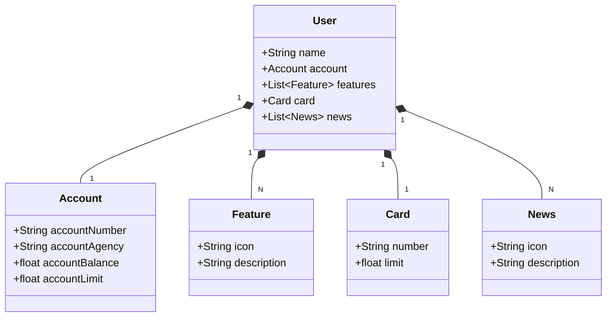

# Santander Bootcamp 2024
Java RESTFul API desenvolvida como desafio do Bootcamp Santander | DIO - Digital Innovation One

## Diagrama de classes UML - Mermaid

```mermaid
classDiagram
    class User {
        +String name
        +Account account
        +List~Feature~ features
        +Card card
        +List~News~ news
    }

    class Account {
        +String accountNumber
        +String accountAgency
        +float accountBalance
        +float accountLimit
    }

    class Feature {
        +String icon
        +String description
    }

    class Card {
        +String number
        +float limit
    }

    class News {
        +String icon
        +String description
    }

    User "1" *-- "1" Account
    User "1" *-- "N" Feature
    User "1" *-- "1" Card
    User "1" *-- "N" News
```
